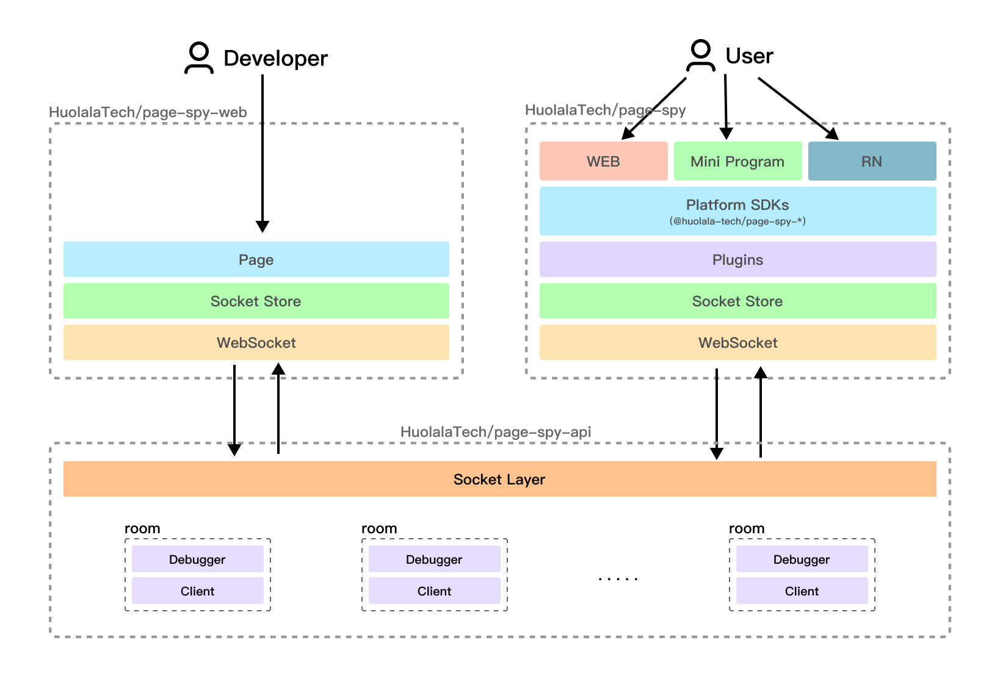

[page-spy-web]: https://github.com/HuolalaTech/page-spy-web 'WebUI repo'
[page-spy-api]: https://github.com/HuolalaTech/page-spy-api 'Server repo'
[page-spy-sdk]: https://github.com/HuolalaTech/page-spy 'SDK repo'
[install-go]: https://go.dev/doc/install 'Go Download'
[github-release]: https://github.com/HuolalaTech/page-spy-web/releases/tag/v1.2.0 'PageSpy Release'
[npm-package]: https://www.npmjs.com/package/@huolala-tech/page-spy-api 'NPM package'

[English](./CONTRIBUTING.md) | [中文](./CONTRIBUTING_ZH.md) | 日本語

# PageSpy コントリビュートガイド

こんにちは！PageSpy へのコントリビュートにお時間を割いていただきありがとうございます。どのようなコントリビュートでも、より良いものにするのに役立ちますので、私たちは本当に興奮しています。投稿の前に、以下のガイドをお読みください。

PageSpy は 3 つのリポジトリから構成されています：

- デバッガ WebUI: [HuolalaTech/page-spy-web][page-spy-web] リポジトリでメンテナンスされています;
- サーバー: [HuolalaTech/page-spy-api][page-spy-api] リポジトリでメンテナンスされています;
- クライアントに注入される SDK: [HuolalaTech/page-spy][page-spy-sdk] リポジトリでメンテナンスされています;



PageSpy は、GitHub Package (推奨) / [NPM package][npm-package] にホストされている Docker イメージ、または [Release][github-release] ページにホストされているバイナリ実行ファイルとして提供されます。

## リポジトリセットアップ

> ヒント: リポジトリごとに開発環境をローカルにセットアップする必要はない。1 つのリポジトリだけに集中して貢献することができます。詳しくは[さまざまなシナリオでのデバッグ](#debugging-in-different-scenarios)をクリックしてください。

### サーバーセットアップ

サーバーは Go 言語で開発されていますので、まずローカルで Go 言語の開発環境を設定してください。詳しくは [Install Go][install-go] をクリックしてください。

始めるには、[HuolalaTech/page-spy-api][page-spy-api] リポジトリをフォークし、ローカルマシンにクローンする。以下の手順に従ってください:

1. `VSCode` またはお好みのエディタで `page-spy-api` プロジェクトを開く;

2. `page-spy-api` ディレクトリで以下のコマンドを実行して、依存関係をインストールする：

   ```bash
   $ go mod tidy
   ```

3. `page-spy-api/bin` ディレクトリに `local.go` ファイルを作成し、内容を更新する:

   ```go
   package main

   import (
      "log"
      "github.com/HuolalaTech/page-spy-api/config"
      "github.com/HuolalaTech/page-spy-api/container"
      "github.com/HuolalaTech/page-spy-api/serve"
   )

   func main() {
      container := container.Container()
      err := container.Provide(func() *config.StaticConfig {
         return &config.StaticConfig{}
      })

      if err != nil {
         log.Fatal(err)
      }
      serve.Run()
   }
   ```

4. `page-spy-api` ディレクトリで以下のコマンドを実行してローカルサーバーを起動する：

   ```bash
   $ go run bin/local.go
   ```

   ターミナルには以下の出力が表示されます:

   ```bash
   ➜  page-spy-api git:(master) ✗ go run bin/local.go
   43860
   INFO[0000] local room manager start                      module=LocalRoomManager
   INFO[0000] remote rpc room manager start
   INFO[0000] init join serve local ok

      ____    __
     / __/___/ /  ___
    / _// __/ _ \/ _ \
   /___/\__/_//_/\___/ v4.9.0
   High performance, minimalist Go web framework
   https://echo.labstack.com
   ____________________________________O/_______
                                       O\
   ⇨ http server started on [::]:6752
   ```

5. サーバーのローカル環境が正常にビルドされているか確認する:

   ```bash
   $ curl http://localhost:6752/api/v1/room/list
   ```

   すべてがうまくいけば、サーバー側の環境が正常にセットアップされたことを示す次のような応答を受け取るはずです:

   ```bash
   {"code":"success","data":[],"success":true,"message":""}
   ```

### デバッガ WebUI セットアップ

[HuolalaTech/page-spy-web][page-spy-web] リポジトリをフォークし、ローカルマシンにクローンする。`page-spy-web` はプロジェクトの依存関係をインストールするパッケージマネージャとして `yarn` を使うことを推奨します。以下の手順に従ってください:

1. `VSCode` またはお好みのエディタで `page-spy-web` プロジェクトを開く;

2. `page-spy-web` ディレクトリで、以下のコマンドを実行して依存関係をインストールする:

   ```bash
   $ yarn install
   ```

3. `page-spy-web` ディレクトリに `.env.local` ファイルを作成し、その内容を更新してサーバー側のアドレスを指定します:

   ```shell
   VITE_API_BASE=localhost:6752
   ```

4. `page-spy-web` ディレクトリで以下のコマンドを実行して、ローカルサーバーを起動する:：

   ```bash
   $ yarn start:client
   ```

   ターミナルには次のように出力されます。ポート番号は異なっていても問題ありません:

   ```bash
    VITE v4.3.9  ready in 1386 ms

     ➜  Local:   http://localhost:5173/
     ➜  Network: use --host to expose
     ➜  press h to show help
   ```

5. ブラウザで http://localhost:5173/ に移動します。初めて開く方はしばらくお待ちください。ブラウザにデバッグ終了が表示されるはずです。

### SDK セットアップ

[HuolalaTech/page-spy][page-spy-sdk] リポジトリをフォークし、ローカルマシンにクローンする。`page-spy` はパッケージマネージャとして `yarn` を使用することを推奨します。以下の手順に従ってください:

1. VSCode またはお好みのエディタで `page-spy` プロジェクトを開く;

2. `page-spy` ディレクトリで、以下のコマンドを実行して依存関係をインストールする:

   ```bash
   $ yarn install
   ```

3. 以下のコマンドを直接使用することができます:：

   - `npx lerna run build`: SDK を生成するためのビルドを行う。製品が生成され、プロジェクトディレクトリの `dist` フォルダに配置される;
   - `yarn test`: 単体テストの実行;

## さまざまなシナリオでのデバッグ

3 つのリポジトリすべての開発環境をローカルにセットアップする必要はありません: もしあなたが [HuolalaTech/page-spy][page-spy-sdk] へのコントリビュートだけに集中したいのであれば、そうすることができます！次の章では、様々なシナリオを通して、素早くコントリビュートする方法を紹介します。

### 準備

PageSpy は、3 つのリポジトリの実装の詳細をパックし、ワンクリックでの使用をサポートする、それを使用するためのいくつかの方法を提供しています。ローカルまたはオンラインにデプロイするお好みの方法を選択してください:

1. Docker イメージを使ってサービスを開始する:

   ```bash
   $ docker run -d --restart=always -p 6752:6752 --name="pageSpy" ghcr.io/huolalatech/page-spy-web:release
   ```

2. NPM パッケージを使用してサービスを開始する:

   ```bash
   $ yarn global add pm2 @huolala-tech/page-spy-api
   $ pm2 start page-spy-api
   ```

3. [Release][github-release] ページにホストされているバイナリ実行ファイルを使用する;

上記の操作が完了したら、サービスが https://example.com にデプロイされたと仮定します。これで、デバッガーウェブ、サーバサイド、SDK の準備がすべて整いました。

テストプロジェクトを作成するか、既存のプロジェクトを使用して SDK をインポートし、サービスに接続します。


### デバッガ WebUI への注力

デバッガーへの貢献だけに集中したい場合は、[Debugger WebUI Setup](#debugger-webui-setup)の手順に従ってサービスをローカルにセットアップしてください。3 番目のステップでは、次のように更新します:

```bash
# .env.local
VITE_API_BASE=example.com
```

> ヒント: "example.com" は、https://example.com、サービスをデプロイしたと仮定しているだけなので、実際のデプロイアドレスに置き換えてください。

サービス開始後、ブラウザでデバッグ終了アドレス http://localhost:5173 を開いてください。ポートが異なる場合がありますので、各サービスが表示するアドレスに従ってアクセスしてください。上部にある "Doc" メニューをクリックし、指示に従ってテストプロジェクトにアクセスします。インスタンス化には構成を渡す必要があります:

```ts
new PageSpy({
  api: 'example.com',
  clientOrigin: 'http://localhost:5173',
  project: '<any name>',
  ...
});
```

テストプロジェクトを開始します。テストプロジェクトのページの左下に PageSpy のロゴ（PageSpy のロゴが真ん中にある白い円形の容器）が表示されるはずです。https://localhost:5173 からテストプロジェクトのデバッグルームにアクセスすると、テストプロジェクトのデバッグルームがリストに表示されるはずです。これで、デバッグ終了コードを修正し、デバッグ終了リポジトリに貢献できるようになります。

### SDK への注力

SDK への貢献だけに集中したい場合は、[SDK セットアップ](#sdk-setup)の手順に従って、ローカルでサービスをセットアップしてください。

`--scope` パラメータを使用してターミナル コマンドを実行することをお勧めします。変更が発生すると自動的にビルドされます。例えば:

```bash
$ npx lerna run build --scope=@huolala-tech/page-spy-wechat -- -w
```

これにより、SDK 製品がビルドされ、`packages/*/dist` ディレクトリに生成されます。ビルドされた SDK 製品をテストプロジェクトにインポートし、PageSpy をインスタンス化するには、次の設定を渡す必要があります:

```ts
new PageSpy({
  api: 'example.com',
  clientOrigin: 'http://example.com',
  project: '<any name>',
  ...
});
```

テストプロジェクトを開始します。テストプロジェクトのページの右下に PageSpy のロゴ（PageSpy のロゴが真ん中にある白い円形の容器）が表示されるはずです。https://example.com からテストプロジェクトの "Connections" にアクセスすると、テストプロジェクトのデバッグルームがリストに表示されるはずです。これで、SDK コードを修正し、SDK リポジトリにコントリビュートすることができます。
