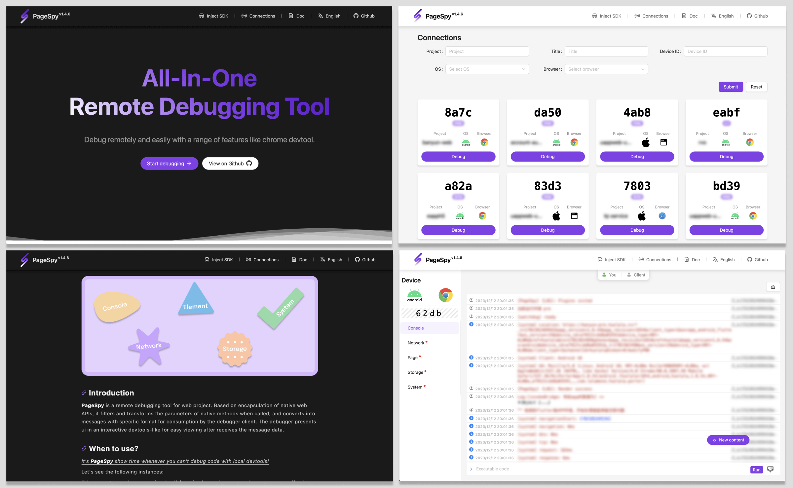
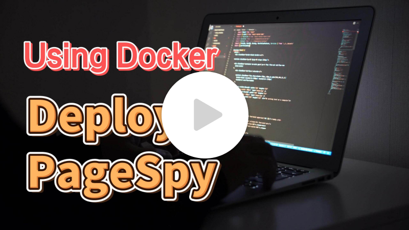

[page-spy]: https://github.com/HuolalaTech/page-spy.git 'page-spy'
[license-img]: https://img.shields.io/github/license/HuolalaTech/page-spy-web?label=License
[license-url]: https://github.com/HuolalaTech/page-spy-web/blob/main/LICENSE
[release-img]: https://img.shields.io/github/package-json/v/HuolalaTech/page-spy-web/release?label=Release
[release-url]: https://github.com/HuolalaTech/page-spy-web/blob/release/package.json
[download-img]: https://img.shields.io/npm/dw/%40huolala-tech/page-spy-api
[download-url]: https://www.npmjs.com/package/@huolala-tech/page-spy-api
[browser-ver-img]: https://img.shields.io/npm/v/@huolala-tech/page-spy-browser?label=Browser%20SDK&color=orange
[browser-ver-url]: https://npmjs.com/package/@huolala-tech/page-spy-browser
[uniapp-ver-img]: https://img.shields.io/npm/v/@huolala-tech/page-spy-uniapp?label=UniApp%20SDK&color=green
[uniapp-ver-url]: https://npmjs.com/package/@huolala-tech/page-spy-uniapp
[wechat-ver-img]: https://img.shields.io/npm/v/@huolala-tech/page-spy-wechat?label=Wechat%20SDK&color=green
[wechat-ver-url]: https://npmjs.com/package/@huolala-tech/page-spy-wechat
[alipay-ver-img]: https://img.shields.io/npm/v/@huolala-tech/page-spy-alipay?label=Alipay%20SDK&color=blue
[alipay-ver-url]: https://npmjs.com/package/@huolala-tech/page-spy-alipay
[taro-ver-img]: https://img.shields.io/npm/v/@huolala-tech/page-spy-taro?label=Taro%20SDK&color=blue
[taro-ver-url]: https://npmjs.com/package/@huolala-tech/page-spy-taro
[harmony-ver-img]: https://harmony.blucas.me/badge/version/@huolala/page-spy-harmony?label=Harmony%20SDK&color=black
[harmony-ver-url]: https://ohpm.openharmony.cn/#/cn/detail/@huolala%2Fpage-spy-harmony
[sdk-build-img]: https://img.shields.io/github/actions/workflow/status/HuolalaTech/page-spy/coveralls.yml?logo=github&label=build
[sdk-build-url]: https://github.com/HuolalaTech/page-spy/actions/workflows/coveralls.yml
[sdk-coveralls-img]: https://img.shields.io/coverallsCoverage/github/HuolalaTech/page-spy?label=coverage&logo=coveralls
[sdk-coveralls-url]: https://coveralls.io/github/HuolalaTech/page-spy?branch=main
[api-ver-img]: https://img.shields.io/github/v/tag/HuolalaTech/page-spy-api?label=API%20version
[api-ver-url]: https://github.com/HuolalaTech/page-spy-api/tags
[api-go-img]: https://img.shields.io/github/go-mod/go-version/HuolalaTech/page-spy-api?label=go
[api-go-url]: https://github.com/HuolalaTech/page-spy-api/blob/master/go.mod

<div align="center">
  

  <h1>Page Spy</h1>

[![Release][release-img]][release-url]
[![license][license-img]][license-url]
[![Build Status][sdk-build-img]][sdk-build-url] <br />
[![Browser SDK version][browser-ver-img]][browser-ver-url]
[![Wechat SDK version][wechat-ver-img]][wechat-ver-url]
[![Alipay SDK version][alipay-ver-img]][alipay-ver-url] <br />
[![UniApp SDK version][uniapp-ver-img]][uniapp-ver-url]
[![Taro SDK version][taro-ver-img]][taro-ver-url]
[![Harmony SDK version][harmony-ver-img]][harmony-ver-url] <br />
[![API Version][api-ver-img]][api-ver-url]
[![Go Version][api-go-img]][api-go-url]

<a href="https://www.producthunt.com/posts/pagespy?utm_source=badge-featured&utm_medium=badge&utm_souce=badge-pagespy" target="_blank"></a> <a href="https://news.ycombinator.com/item?id=38679798" target="_blank"></a>

English | [中文](./README_ZH.md) | [日本語](./README_JA.md)

</div>

## Intro

**PageSpy** is a tool used for debugging projects on platforms such as Web, Mini Programs, and HarmonyOS apps.

Based on encapsulation of native web APIs, it filters and transforms the parameters of native methods when called, and converts into messages with specific format for consumption by the debugger client. The debugger presents ui in an interactive devtools-like for easy viewing after receives the message data.



## When should I use?

<u>It's **PageSpy** show time whenever you can't debug code with local devtools!</u> Let's see the following instances:

- Debugging of H5 or webview app locally: in the past, some products provided panels that could display information on H5, but the small screens of mobile devices make it inconvenient for operation, and the display is not user-friendly. Issues such as information being truncated are also common.
- Remote work and cross-regional collaboration: traditional communications such as emails, phone calls, and video conferences are inefficient, and fault information is not comprehensive, making it prone to misunderstandings and misjudgments.
- White screen issues on user devices: traditional approaches to troubleshooting, such as data monitoring and log analysis, depend on troubleshooters understanding business requirements and technical implementations.

The commonality among these issues is that developers cannot view runtime information as easily as they can using the console.

To address this, PageSpy provides a live view of the project for technical personnel to inspect on the debugging side. In remote collaborative scenarios, testers no longer need to frequently provide fault information to technical personnel through text, screenshots, voice messages, or screen recordings.

## How to use?

In order to ensure data security and facilitate your usage, we offer comprehensive, out-of-the-box deployment solutions. Developers can choose any deployment method according to their own situations.

### Option 1: deploy by node

> Video tutorial:
>
> <a href="https://www.youtube.com/watch?v=5zVnFPjursQ" target="_blank"></a>

```bash
yarn global add @huolala-tech/page-spy-api@latest

# if you use npm

npm install -g @huolala-tech/page-spy-api@latest
```

After the download is complete, you can directly execute `page-spy-api` in the command line to start the service. Once the deployment is successful, you can open the browser and access `<host>:6752`, the `Inject SDK` menu will be at the top, and you can find how to configure and integrate in the business project by click the menu.

### Option 2: deploy by docker

> Video tutorial:
>
> <a href="https://www.youtube.com/watch?v=AYD84Kht5yA" target="_blank"></a>

```bash
docker run -d --restart=always -p 6752:6752 --name="pageSpy" ghcr.io/huolalatech/page-spy-web:latest
```

Once the deployment is successful, you can open the browser and access `<host>:6752`, the `Inject SDK` menu will be at the top, and you can find how to configure and integrate in the business project by click the menu.

## Community

Join us on our [Official Discord Server](https://discord.gg/ERPpNZkX)!

## Roadmap

Click to see the [Roadmap](https://github.com/orgs/HuolalaTech/projects/1).

## How to contribute?

Click to see the [Contributing](./CONTRIBUTING.md).

## FAQ

Click to see the [FAQ](https://github.com/HuolalaTech/page-spy-web/wiki/faq).
