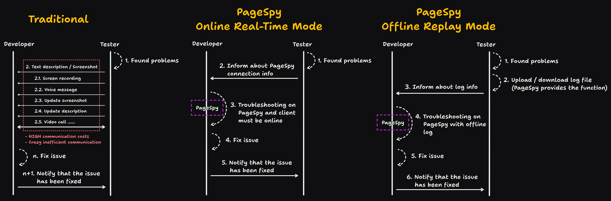

[page-spy]: https://github.com/HuolalaTech/page-spy.git 'page-spy'
[license-img]: https://img.shields.io/github/license/HuolalaTech/page-spy-web?label=License
[license-url]: https://github.com/HuolalaTech/page-spy-web/blob/main/LICENSE
[release-img]: https://img.shields.io/github/package-json/v/HuolalaTech/page-spy-web/release?label=Release
[release-url]: https://github.com/HuolalaTech/page-spy-web/blob/release/package.json
[download-img]: https://img.shields.io/npm/dw/%40huolala-tech/page-spy-api
[download-url]: https://www.npmjs.com/package/@huolala-tech/page-spy-api
[browser-ver-img]: https://img.shields.io/npm/v/@huolala-tech/page-spy-browser?label=Browser&color=orange
[browser-ver-url]: https://npmjs.com/package/@huolala-tech/page-spy-browser
[uniapp-ver-img]: https://img.shields.io/npm/v/@huolala-tech/page-spy-uniapp?label=UniApp&color=green
[uniapp-ver-url]: https://npmjs.com/package/@huolala-tech/page-spy-uniapp
[wechat-ver-img]: https://img.shields.io/npm/v/@huolala-tech/page-spy-wechat?label=Wechat&color=green
[wechat-ver-url]: https://npmjs.com/package/@huolala-tech/page-spy-wechat
[alipay-ver-img]: https://img.shields.io/npm/v/@huolala-tech/page-spy-alipay?label=Alipay&color=blue
[alipay-ver-url]: https://npmjs.com/package/@huolala-tech/page-spy-alipay
[taro-ver-img]: https://img.shields.io/npm/v/@huolala-tech/page-spy-taro?label=Taro&color=blue
[taro-ver-url]: https://npmjs.com/package/@huolala-tech/page-spy-taro
[harmony-ver-img]: https://harmony.blucas.me/badge/version/@huolala/page-spy-harmony?label=Harmony&color=black
[harmony-ver-url]: https://ohpm.openharmony.cn/#/cn/detail/@huolala%2Fpage-spy-harmony
[sdk-build-img]: https://img.shields.io/github/actions/workflow/status/HuolalaTech/page-spy/coveralls.yml?logo=github&label=build
[sdk-build-url]: https://github.com/HuolalaTech/page-spy/actions/workflows/coveralls.yml
[sdk-coveralls-img]: https://img.shields.io/coverallsCoverage/github/HuolalaTech/page-spy?label=coverage&logo=coveralls
[sdk-coveralls-url]: https://coveralls.io/github/HuolalaTech/page-spy?branch=main
[api-ver-img]: https://img.shields.io/github/v/tag/HuolalaTech/page-spy-api?label=API
[api-ver-url]: https://github.com/HuolalaTech/page-spy-api/tags
[api-go-img]: https://img.shields.io/github/go-mod/go-version/HuolalaTech/page-spy-api?label=go
[api-go-url]: https://github.com/HuolalaTech/page-spy-api/blob/master/go.mod
[node-deploy]: https://img.shields.io/badge/Node_Deploy-Install-CB3937
[node-deploy-url]: https://pagespy.org/#/docs/deploy-with-node
[docker-deploy]: https://img.shields.io/badge/Docker_Deploy-Install-1E63ED
[docker-deploy-url]: https://pagespy.org/#/docs/deploy-with-docker
[bt-deploy]: https://img.shields.io/badge/BT_Deploy-Install-20a53a
[bt-deploy-url]: https://pagespy.org/#/docs/deploy-with-baota

<div align="center">
  

  <h1>PageSpy</h1>

[![Release][release-img]][release-url]
[![license][license-img]][license-url]
[![Build Status][sdk-build-img]][sdk-build-url] <br />
[![Browser SDK version][browser-ver-img]][browser-ver-url]
[![Wechat SDK version][wechat-ver-img]][wechat-ver-url]
[![Alipay SDK version][alipay-ver-img]][alipay-ver-url]
[![UniApp SDK version][uniapp-ver-img]][uniapp-ver-url]
[![Taro SDK version][taro-ver-img]][taro-ver-url]
[![Harmony SDK version][harmony-ver-img]][harmony-ver-url]
[![API Version][api-ver-img]][api-ver-url] <br />
[![Deploy with Node][node-deploy]][node-deploy-url]
[![Deploy with Docker][docker-deploy]][docker-deploy-url]
[![Deploy with Baota][bt-deploy]][bt-deploy-url]

<a href="https://trendshift.io/repositories/5407" target="_blank"></a>
<a href="https://www.producthunt.com/posts/pagespy?utm_source=badge-featured&utm_medium=badge&utm_souce=badge-pagespy" target="_blank"></a>
<a href="https://news.ycombinator.com/item?id=38679798" target="_blank"></a>

English | [中文](./README_ZH.md) | [日本語](./README_JA.md)

</div>

## Intro

**PageSpy** is a tool used for debugging projects on platforms such as Web, ReactNative, Mini Programs, and HarmonyOS apps.

It encapsulates native APIs, filtering and transforming the parameters when native methods are invoked, and organizes them into a standard format for transmission to the debugging client. The debugging client then presents the data intuitively through an interface similar to the local console.


## Why is PageSpy?

> A picture is worth a thousand words.



## When to Use?

_PageSpy shines in any scenario where local console debugging is not possible!_ Let's explore some use cases:

- **Local Debugging of H5 and Webview Applications**: Mobile screens are too small, traditional debugging panels are inconvenient to operate, display poorly, and prone to information truncation.

- **Remote Work and Cross-Region Collaboration**: Traditional communication methods (email, phone, video conferencing) are inefficient, fault information is incomplete, and misunderstandings and misjudgments easily occur.

- **Troubleshooting White Screen Issues on User Terminals**: Data monitoring, log analysis and other traditional methods rely on the troubleshooting team's deep understanding of business and technology, resulting in low localization efficiency.

Yep, the goal of PageSpy is can help the people which in like above cases.

## How to use?

In order to ensure data security and facilitate your usage, we offer comprehensive, out-of-the-box deployment solutions. Developers can choose any deployment method according to their own situations.

### Option 1: deploy by node

> Video tutorial:
>
> <a href="https://www.youtube.com/watch?v=5zVnFPjursQ" target="_blank"></a>

```bash
yarn global add @huolala-tech/page-spy-api@latest

# if you use npm

npm install -g @huolala-tech/page-spy-api@latest
```

After the download is complete, you can directly execute `page-spy-api` in the command line to start the service. After the startup is complete, visit `http://localhost:6752` on the browser. Once local testing is complete, you can deploy it to the server.

### Option 2: deploy by docker

> Video tutorial:
>
> <a href="https://www.youtube.com/watch?v=AYD84Kht5yA" target="_blank"></a>

```bash
docker run -d --restart=always -v ./log:/app/log -v ./data:/app/data -p 6752:6752 --name="pageSpy" ghcr.io/huolalatech/page-spy-web:latest
```

After the startup is complete, visit `http://localhost:6752` on the browser. Once local testing is complete, you can deploy it to the server.

## How to contribute?

Click to see the [Contributing](./CONTRIBUTING.md).

## FAQ

Click to see the [FAQ](https://www.pagespy.org/#/docs/faq).

## Community

Join us on our [Official Discord Server](https://discord.gg/ERPpNZkX)!

## Roadmap

Click to see the [Roadmap](https://github.com/orgs/HuolalaTech/projects/1).
