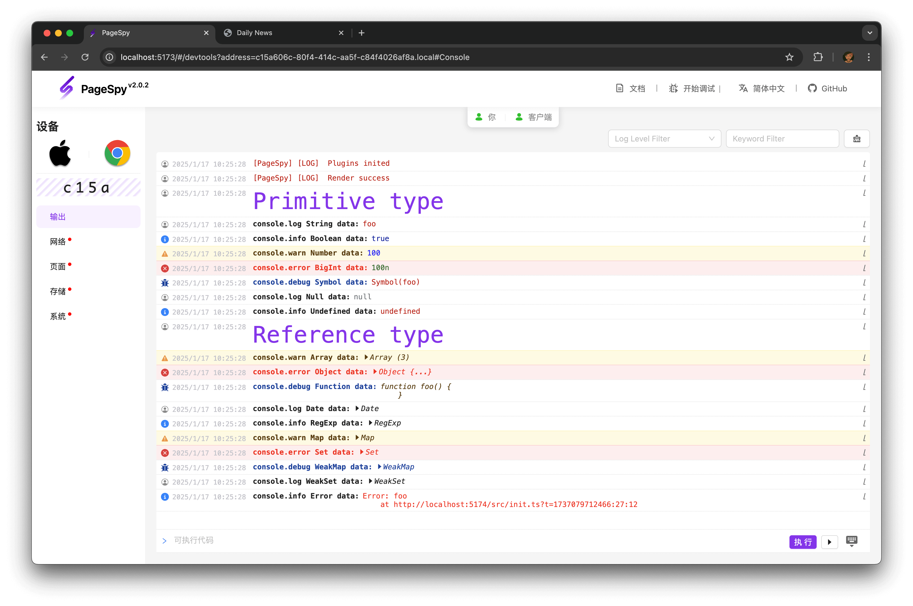
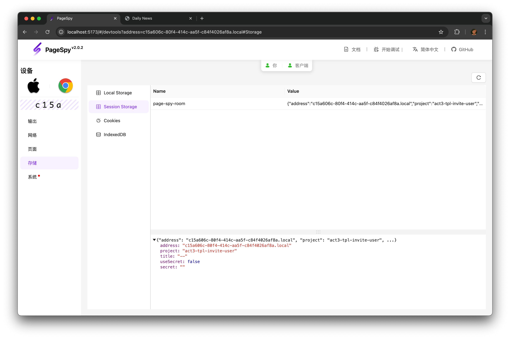

[page-spy]: https://github.com/HuolalaTech/page-spy.git 'page-spy'

English | [中文](./README_CN.md)

<p align="center">
  
</p>

<h1 align="center">PageSpyWeb</h1>

> **PageSpy** is a remote debugging tool for web project. Based on encapsulation
> of native web APIs, it filters and transforms the parameters of native methods
> when called, and converts into messages with specific format for consumption by
> the debugger client. The debugger presents ui in an interactive devtools-like for
> easy viewing after receives the message data.

## When should I use?

<u>It's **PageSpy** show time whenever you can't debug code with local devtools!</u>
Let's see the following instances:

**Save communication time, improve collaboration efficiency**: Telecommuting and cross-regional collaboration becoming more and more common,effective collaboration
between programmers and testers become extremely important. However, traditional communication such as
email, telephone, and video conferencing suffer from inefficient communication, incomplete issue information,
and misunderstanding or misjudgment, etc. PageSpy provides project runtime info for technicians to view
at the debugger client, and testers no longer need to provide issue information to technicians frequently
by text, screenshot, and recording screen.

**Accurately troubleshoot to avoid looking a needle in the ocean**: When an application has a white screen or other similar fatal problems on the user's device,
it has always been a difficult problem for technicians to quickly locate the error,
accurately troubleshoot and fix it. Traditional methods of locating problems include
data monitoring and log analysis, which not only consume a lot of time and energy
to analyze and diagnose problems, but also rely heavily on technicians to understand business
scenarios and code implementation.PageSpy presents the error message directly to the technician,
eliminates other interference, just shows the code!

## How to use?

For data security and your convenience, we provide a complete and
out-of-box deployment solution.

TODO

Once the deployment is successful, the `Inject SDK` menu will be at the top, and you can view how to
configure and integrate in the business project by click the menu.

## Feature overview

### Console Panel

> Show the `console.<log | info | warn | error>` log data, support execute code；

<details>
  <summary>
    Screenshot
  </summary>



</details>

---

### Network Panel

> Show the request of `fetch` | `XMLHttpRequest` | `navigator.sendBeacon`;

<details>
  <summary>
    Screenshot
  </summary>


</details>

---

### Page Panel

> Show the current pageview and HTML node tree；

<details>
  <summary>
    Screenshot
  </summary>


</details>

---

### Storage Panel

> Show the cache of `localStorage` | `sessionStorage` | `cookie`；

<details>
  <summary>
    Screenshot
  </summary>



</details>

---

### Systems Panel

> Show the userAgent info and some APIs compatibility;

<details>
  <summary>
    Screenshot
  </summary>


</details>

Besides of above, you will get the realtime notification when there have new data or data changed.

## Develop

1. Clone the repo:

```bash
git clone https://github.com/HuolalaTech/page-spy-web.git
```

2. Install the deps:

```bash
yarn install
```

3. Local development:

```bash
yarn start
```

4. Build for production

```bash
yarn build:client
```
