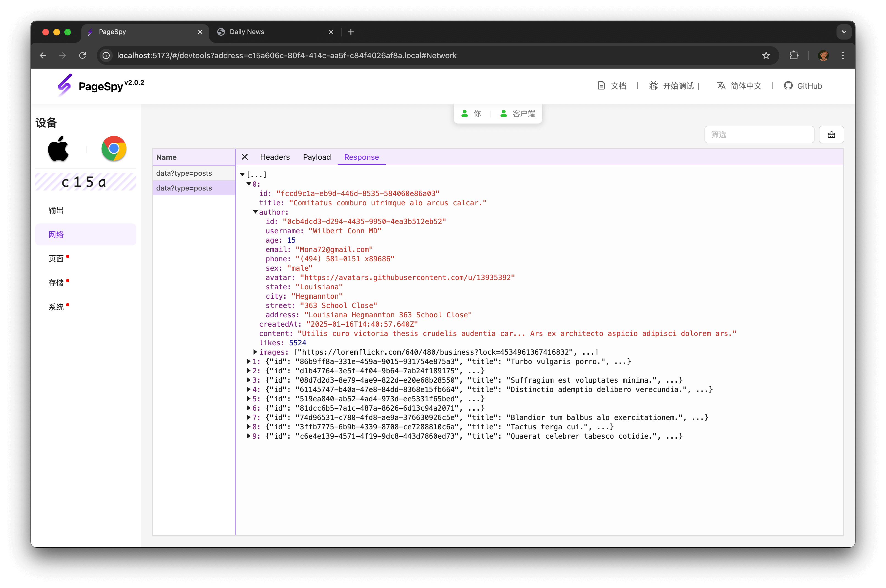

[page-spy]: https://github.com/HuolalaTech/page-spy.git 'page-spy'

[English](./README.md) | 中文

<p align="center">
  
</p>

<h1 align="center">PageSpyWeb</h1>

## 介绍

**PageSpy** 是一款用来调试远程 Web 项目的工具。

基于对原生 API 的封装，它将调用原生方法时的参数进行过滤、转化，整理成格式规范的消息供调试端消费；调试端收到消息数据，提供类控制台可交互式的功能界面将数据呈现出来。

## 何时使用？

<u>任何无法在本地使用控制台调试的场景，都是 **PageSpy** 可以大显身手的时候！</u>一起来看下面的两个例子：

**节省沟通成本，提升协同效率**：在现代远程工作和跨地区合作变得越来越普遍的背景下，技术人员和测试人员之间的有效协同变得异常重要。然而，传统的沟通方式如邮件、电话、视频会议等存在沟通效率不高、故障信息不全面、误解误判等。PageSpy 提供项目运行现场供技术人员在调试端查看，测试人员不用再频繁的通过文字、截图、录屏等方式向技术人员提供故障信息。

**精准高效排障，避免大海捞针**：当应用在用户的终端上出现白屏或其他类似致命问题时，快速定位、精准排障并修复问题一直是技术人员面临的难题。传统定位问题的方式包括数据监控、日志分析等，这些方式不仅会耗费大量的时间和精力来分析和诊断问题，还极度依赖排障人员非常理解业务需求场景、技术实现。PageSpy 将错误信息直接呈现给技术人员，排除一切信息干扰，show the code!

## 如何使用？

为了数据安全和方便您的使用，我们提供完整的、开箱即用的部署方案。

### Docker 部署 👍

```bash
$ docker run -d --restart=always -p 6752:6752 --name="pageSpy" ghcr.io/huolalatech/page-spy-web:release
```

### Node 部署

> 提示：这会根据不同的平台下载对应的二进制文件，二进制文件包含了必要的所有内容，所以下载需要一点时间，请耐心等待。

```bash
$ yarn global add @huolala-tech/page-spy-api

# 如果你使用 npm

$ npm install -g @huolala-tech/page-spy-api
```

下载完成之后你可以在命令行中直接执行 `page-spy-api` 启动服务。
同时还会在运行目录下面生成配置文件 config.json，修改配置文件可以修改运行端口

```json
{
  "port": "6752"
}
```

部署完成后，页面顶部会出现 `接入SDK` 菜单，点击菜单查看如何在业务项目中配置并集成。

## 功能概览

### Console 面板

> 显示 `console.<log | info | warn | error>` 日志信息，可以执行代码；

<details>
  <summary>Screenshot</summary>


</details>

---

### Network 面板

> 显示 `fetch` | `XMLHttpRequest` | `navigator.sendBeacon` 的网络请求；

<details>
  <summary>Screenshot</summary>



</details>

---

### Page 面板

> 显示当前页面，查看 HTML 节点树；

<details>
  <summary>Screenshot</summary>


</details>

---

### Storage 面板

> 查看 `localStorage` | `sessionStorage` | `cookie` 缓存数据；

<details>
  <summary>Screenshot</summary>


</details>

---

### Systems 面板

> 显示 userAgent 信息，查看 api 兼容性;

<details>
  <summary>Screenshot</summary>


</details>

---

除此之外，当有新的数据或者数据发生变化的时候会实时的收到通知。

## 技术支持

有问题可以使用微信扫码进群。


## 开发

1. 克隆仓库:

```bash
git clone https://github.com/HuolalaTech/page-spy-web.git
```

2. 安装依赖:

```bash
yarn install
```

3. 本地开发:

```bash
# 前端
yarn start:client

# 后端
yarn start:server
```

4. 生产构建

```bash
yarn build:client
```
