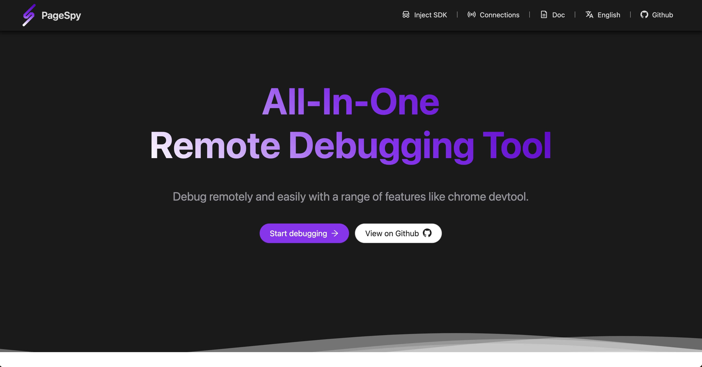

[page-spy]: https://github.com/HuolalaTech/page-spy.git 'page-spy'

English | [中文](./README.md)

<p align="center">
  
</p>

<h1 align="center">Page Spy</h1>

**PageSpy** is a remote debugging tool for web project.

Based on encapsulation of native web APIs, it filters and transforms the parameters of native methods when called, and converts into messages with specific format for consumption by the debugger client. The debugger presents ui in an interactive devtools-like for easy viewing after receives the message data.

[](https://huolalatech.github.io/page-spy-web)

## When should I use?

<u>It's **PageSpy** show time whenever you can't debug code with local devtools!</u> Let's see the following instances:

- Debugging of H5 or webview app locally: in the past, some products provided panels that could display information on H5, but the small screens of mobile devices make it inconvenient for operation, and the display is not user-friendly. Issues such as information being truncated are also common.
- Remote work and cross-regional collaboration: traditional communications such as emails, phone calls, and video conferences are inefficient, and fault information is not comprehensive, making it prone to misunderstandings and misjudgments.
- White screen issues on user devices: traditional approaches to troubleshooting, such as data monitoring and log analysis, depend on troubleshooters understanding business requirements and technical implementations.

The commonality among these issues is that developers cannot view runtime information as easily as they can using the console.

To address this, PageSpy provides a live view of the project for technical personnel to inspect on the debugging side. In remote collaborative scenarios, testers no longer need to frequently provide fault information to technical personnel through text, screenshots, voice messages, or screen recordings.

## How to use?

In order to ensure data security and facilitate your usage, we offer comprehensive, out-of-the-box deployment solutions. Developers can choose any deployment method according to their own situations.

### Option 1: deploy by docker

> Video tutorial: [Deploy PageSpy with docker](https://youtu.be/LttXrBbVqbI?si=AvcI9Fr1YdmyTCD1)

```bash
$ docker run -d --restart=always -p 6752:6752 --name="pageSpy" ghcr.io/huolalatech/page-spy-web:release
```

Once the deployment is successful, you can open the browser and access `<host>:6752`, the `Inject SDK` menu will be at the top, and you can find how to configure and integrate in the business project by click the menu.

### Option 2: deploy by node

> Video tutorial: [Deploy PageSpy with node](https://youtu.be/Xf7S6TPbYd0?si=J4vc_A-8AekCesUf)

```bash
$ yarn global add @huolala-tech/page-spy-api

# if you use npm

$ npm install -g @huolala-tech/page-spy-api
```

After the download is complete, you can directly execute `page-spy-api` in the command line to start the service. Once the deployment is successful, you can open the browser and access `<host>:6752`, the `Inject SDK` menu will be at the top, and you can find how to configure and integrate in the business project by click the menu.

### How to Modify API Service Configuration

#### Modifying the Port

Executing the page-spy-api command directly in the command line will generate a configuration file named config.json in the working directory. You can modify the running port by modifying this configuration file:

```json
{
  "port": "6752"
}
```

#### Multi-instance Deployment (Requires upgrading to version 1.5.0 or above)

The rpcAddress configuration is used for multi-instance deployment, where IP and port represent the IP addresses and RPC ports of multiple machines. Multiple instances communicate with each other through RPC, and the program starts the RPC service based on the machine's IP. Therefore, it is important to ensure that IP addresses are unique to avoid potential issues of message confusion or loss.

```json
{
  "port": "6752",
  "rpcAddress": [
    {
      "ip": "192.168.123.1",
      "port": "20008"
    },
    {
      "ip": "192.168.123.2",
      "port": "20008"
    }
  ]
}
```

## Roadmap

Click to see the [Roadmap](https://github.com/orgs/HuolalaTech/projects/1).

## How to contribute?

Click to see the [Contribution](./CONTRIBUTING_EN.md).

## FAQ

Click to see the [FAQ](https://github.com/HuolalaTech/page-spy-web/wiki/faq).
