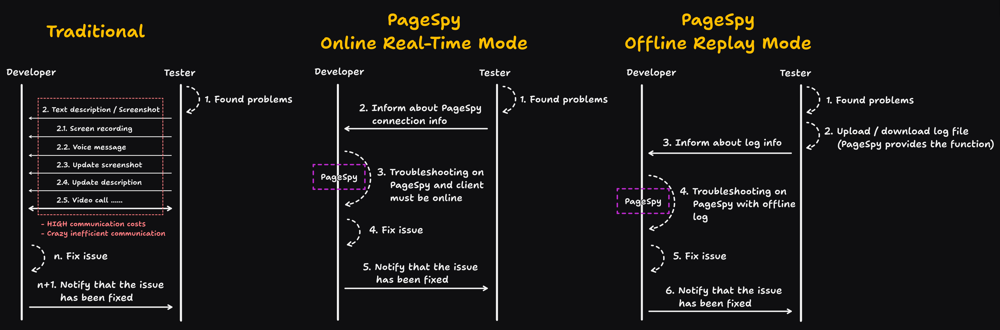

[page-spy]: https://github.com/HuolalaTech/page-spy.git 'page-spy'
[license-img]: https://img.shields.io/github/license/HuolalaTech/page-spy-web?label=License
[license-url]: https://github.com/HuolalaTech/page-spy-web/blob/main/LICENSE
[release-img]: https://img.shields.io/github/package-json/v/HuolalaTech/page-spy-web/release?label=Release
[release-url]: https://github.com/HuolalaTech/page-spy-web/blob/release/package.json
[download-img]: https://img.shields.io/npm/dw/%40huolala-tech/page-spy-api
[download-url]: https://www.npmjs.com/package/@huolala-tech/page-spy-api
[browser-ver-img]: https://img.shields.io/npm/v/@huolala-tech/page-spy-browser?label=Browser&color=orange
[browser-ver-url]: https://npmjs.com/package/@huolala-tech/page-spy-browser
[uniapp-ver-img]: https://img.shields.io/npm/v/@huolala-tech/page-spy-uniapp?label=UniApp&color=green
[uniapp-ver-url]: https://npmjs.com/package/@huolala-tech/page-spy-uniapp
[wechat-ver-img]: https://img.shields.io/npm/v/@huolala-tech/page-spy-wechat?label=Wechat&color=green
[wechat-ver-url]: https://npmjs.com/package/@huolala-tech/page-spy-wechat
[alipay-ver-img]: https://img.shields.io/npm/v/@huolala-tech/page-spy-alipay?label=Alipay&color=blue
[alipay-ver-url]: https://npmjs.com/package/@huolala-tech/page-spy-alipay
[taro-ver-img]: https://img.shields.io/npm/v/@huolala-tech/page-spy-taro?label=Taro&color=blue
[taro-ver-url]: https://npmjs.com/package/@huolala-tech/page-spy-taro
[harmony-ver-img]: https://harmony.blucas.me/badge/version/@huolala/page-spy-harmony?label=Harmony&color=black
[harmony-ver-url]: https://ohpm.openharmony.cn/#/cn/detail/@huolala%2Fpage-spy-harmony
[sdk-build-img]: https://img.shields.io/github/actions/workflow/status/HuolalaTech/page-spy/coveralls.yml?logo=github&label=build
[sdk-build-url]: https://github.com/HuolalaTech/page-spy/actions/workflows/coveralls.yml
[sdk-coveralls-img]: https://img.shields.io/coverallsCoverage/github/HuolalaTech/page-spy?label=coverage&logo=coveralls
[sdk-coveralls-url]: https://coveralls.io/github/HuolalaTech/page-spy?branch=main
[api-ver-img]: https://img.shields.io/github/v/tag/HuolalaTech/page-spy-api?label=API
[api-ver-url]: https://github.com/HuolalaTech/page-spy-api/tags
[api-go-img]: https://img.shields.io/github/go-mod/go-version/HuolalaTech/page-spy-api?label=go
[api-go-url]: https://github.com/HuolalaTech/page-spy-api/blob/master/go.mod
[node-deploy]: https://img.shields.io/badge/Node_Deploy-Install-CB3937
[node-deploy-url]: https://pagespy.org/#/docs/deploy-with-node
[docker-deploy]: https://img.shields.io/badge/Docker_Deploy-Install-1E63ED
[docker-deploy-url]: https://pagespy.org/#/docs/deploy-with-docker
[bt-deploy]: https://img.shields.io/badge/BT_Deploy-Install-20a53a
[bt-deploy-url]: https://pagespy.org/#/docs/deploy-with-baota

<div align="center">
  

  <h1>Page Spy</h1>

[![Release][release-img]][release-url]
[![license][license-img]][license-url]
[![Build Status][sdk-build-img]][sdk-build-url] <br />
[![Browser SDK version][browser-ver-img]][browser-ver-url]
[![Wechat SDK version][wechat-ver-img]][wechat-ver-url]
[![Alipay SDK version][alipay-ver-img]][alipay-ver-url]
[![UniApp SDK version][uniapp-ver-img]][uniapp-ver-url]
[![Taro SDK version][taro-ver-img]][taro-ver-url]
[![Harmony SDK version][harmony-ver-img]][harmony-ver-url]
[![API Version][api-ver-img]][api-ver-url] <br />
[![Deploy with Node][node-deploy]][node-deploy-url]
[![Deploy with Docker][docker-deploy]][docker-deploy-url]
[![Deploy with Baota][bt-deploy]][bt-deploy-url]

<a href="https://trendshift.io/repositories/5407" target="_blank"></a>
<a href="https://www.producthunt.com/posts/pagespy?utm_source=badge-featured&utm_medium=badge&utm_souce=badge-pagespy" target="_blank"></a>
<a href="https://news.ycombinator.com/item?id=38679798" target="_blank"></a>

[English](./README.md) | [中文](./README_ZH.md) | 日本語

</div>

## Intro

PageSpy は、Web / Miniprogram / 鸿蒙（Harmony）OS APP プロジェクトなどのプラットフォームのデバッグに使用されるツールです。

ネイティブ API のラッパーを基にして、ネイティブメソッドの呼び出し時のパラメータをフィルタリング・変換し、標準形式に整えてデバッグクライアントに送信します。デバッグクライアントは、ローカルコンソールのようなインターフェースを通じてデータを直感的に表示します。


## なぜ PageSpy なのか?

> 百聞は一見にしかず。



## いつ使用するか？

_ローカルでコンソールデバッグができないシーンは、すべて**PageSpy**が活躍できる場面です！_ 以下のようなシーンケースを見てみましょう：

- **H5、Webview アプリケーションのローカルデバッグ**：モバイル端末の画面が小さすぎ、従来のデバッグパネルは操作が不便で、表示が悪く、情報の切り捨てが発生しやすいです。
- **リモートワーク、地域間協力**：従来のコミュニケーション方法（メール、電話、ビデオ会議）は効率が低く、障害情報が不完全で、誤解や誤判断が起こりやすいです。
- **ユーザー端末での白画面問題のトラブルシューティング**：データモニタリング、ログ分析などの従来の方法は、トラブルシューティングチームがビジネスと技術を深く理解することに依存しており、特定効率が低くなります。

PageSpy の目標は、上記のようなシーンに関わる人々をサポートすることです。

## 使用方法は？

データのセキュリティを確保し、利用を容易にするために、私たちは包括的な、すぐに使えるデプロイソリューションを提供しています。開発者は、それぞれの状況に応じて、どのようなデプロイ方法を選択することもできます。

### オプション 1: node によるデプロイ 👍

> ビデオチュートリアル:
>
> <a href="https://www.youtube.com/watch?v=5zVnFPjursQ" target="_blank"></a>

```bash
yarn global add @huolala-tech/page-spy-api@latest

# npm を使用する場合

npm install -g @huolala-tech/page-spy-api@latest
```

ダウンロードが完了したら、コマンドラインで `page-spy-api` を直接実行してサービスを開始することができます。起動完了後、ブラウザで `http://localhost:6752` にアクセスし、ローカルテストが完了したらサーバーにデプロイすることができます。

### オプション 2: docker によるデプロイ

> ビデオチュートリアル:
>
> <a href="https://www.youtube.com/watch?v=AYD84Kht5yA" target="_blank"></a>

```bash
docker run -d --restart=always -v ./log:/app/log -v ./data:/app/data -p 6752:6752 --name="pageSpy" ghcr.io/huolalatech/page-spy-web:latest
```

起動完了後、ブラウザで `http://localhost:6752` にアクセスし、ローカルテストが完了したらサーバーにデプロイすることができます。

## コントリビュートするには？

クリックして [Contributing](./CONTRIBUTING.md) をご覧ください。

## FAQ

クリックして [FAQ](https://www.pagespy.org/#/docs/faq) をご覧ください。

## コミュニティ

[公式 Discord サーバー](https://discord.gg/ERPpNZkX)に参加してください！

## ロードマップ

クリックして [Roadmap](https://github.com/orgs/HuolalaTech/projects/1) をご覧ください。
