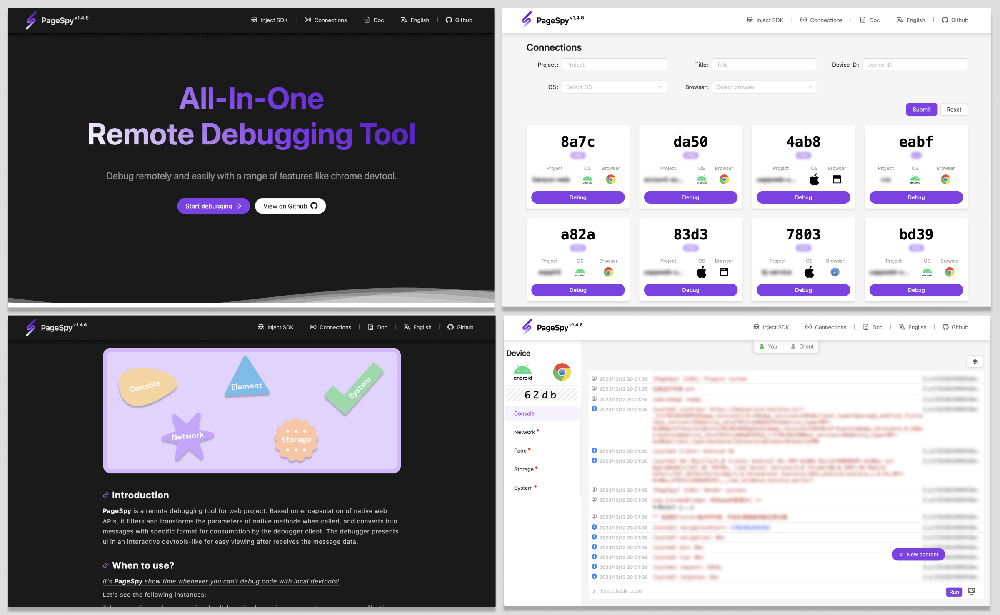
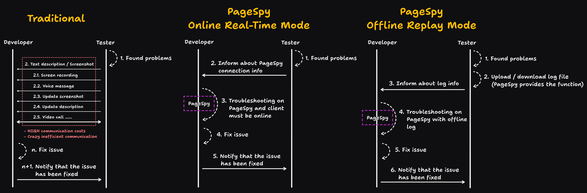
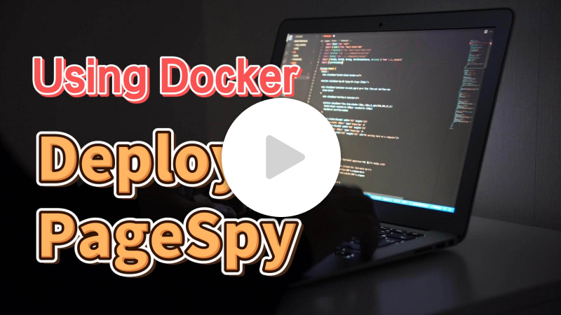

[page-spy]: https://github.com/HuolalaTech/page-spy.git 'page-spy'
[license-img]: https://img.shields.io/github/license/HuolalaTech/page-spy-web?label=License
[license-url]: https://github.com/HuolalaTech/page-spy-web/blob/main/LICENSE
[release-img]: https://img.shields.io/github/package-json/v/HuolalaTech/page-spy-web/release?label=Release
[release-url]: https://github.com/HuolalaTech/page-spy-web/blob/release/package.json
[download-img]: https://img.shields.io/npm/dw/%40huolala-tech/page-spy-api
[download-url]: https://www.npmjs.com/package/@huolala-tech/page-spy-api
[browser-ver-img]: https://img.shields.io/npm/v/@huolala-tech/page-spy-browser?label=Browser&color=orange
[browser-ver-url]: https://npmjs.com/package/@huolala-tech/page-spy-browser
[uniapp-ver-img]: https://img.shields.io/npm/v/@huolala-tech/page-spy-uniapp?label=UniApp&color=green
[uniapp-ver-url]: https://npmjs.com/package/@huolala-tech/page-spy-uniapp
[wechat-ver-img]: https://img.shields.io/npm/v/@huolala-tech/page-spy-wechat?label=Wechat&color=green
[wechat-ver-url]: https://npmjs.com/package/@huolala-tech/page-spy-wechat
[alipay-ver-img]: https://img.shields.io/npm/v/@huolala-tech/page-spy-alipay?label=Alipay&color=blue
[alipay-ver-url]: https://npmjs.com/package/@huolala-tech/page-spy-alipay
[taro-ver-img]: https://img.shields.io/npm/v/@huolala-tech/page-spy-taro?label=Taro&color=blue
[taro-ver-url]: https://npmjs.com/package/@huolala-tech/page-spy-taro
[harmony-ver-img]: https://harmony.blucas.me/badge/version/@huolala/page-spy-harmony?label=Harmony&color=black
[harmony-ver-url]: https://ohpm.openharmony.cn/#/cn/detail/@huolala%2Fpage-spy-harmony
[sdk-build-img]: https://img.shields.io/github/actions/workflow/status/HuolalaTech/page-spy/coveralls.yml?logo=github&label=build
[sdk-build-url]: https://github.com/HuolalaTech/page-spy/actions/workflows/coveralls.yml
[sdk-coveralls-img]: https://img.shields.io/coverallsCoverage/github/HuolalaTech/page-spy?label=coverage&logo=coveralls
[sdk-coveralls-url]: https://coveralls.io/github/HuolalaTech/page-spy?branch=main
[api-ver-img]: https://img.shields.io/github/v/tag/HuolalaTech/page-spy-api?label=API
[api-ver-url]: https://github.com/HuolalaTech/page-spy-api/tags
[api-go-img]: https://img.shields.io/github/go-mod/go-version/HuolalaTech/page-spy-api?label=go
[api-go-url]: https://github.com/HuolalaTech/page-spy-api/blob/master/go.mod
[node-deploy]: https://img.shields.io/badge/Node_Deploy-Install-CB3937
[node-deploy-url]: https://pagespy.org/#/docs/deploy-with-node
[docker-deploy]: https://img.shields.io/badge/Docker_Deploy-Install-1E63ED
[docker-deploy-url]: https://pagespy.org/#/docs/deploy-with-docker
[bt-deploy]: https://img.shields.io/badge/BT_Deploy-Install-20a53a
[bt-deploy-url]: https://pagespy.org/#/docs/deploy-with-baota

<div align="center">
  

  <h1>PageSpy</h1>

[![Release][release-img]][release-url]
[![license][license-img]][license-url]
[![Build Status][sdk-build-img]][sdk-build-url] <br />
[![Browser SDK version][browser-ver-img]][browser-ver-url]
[![Wechat SDK version][wechat-ver-img]][wechat-ver-url]
[![Alipay SDK version][alipay-ver-img]][alipay-ver-url]
[![UniApp SDK version][uniapp-ver-img]][uniapp-ver-url]
[![Taro SDK version][taro-ver-img]][taro-ver-url]
[![Harmony SDK version][harmony-ver-img]][harmony-ver-url]
[![API Version][api-ver-img]][api-ver-url] <br />
[![Deploy with Node][node-deploy]][node-deploy-url]
[![Deploy with Docker][docker-deploy]][docker-deploy-url]
[![Deploy with Baota][bt-deploy]][bt-deploy-url]

<a href="https://trendshift.io/repositories/5407" target="_blank"></a>
<a href="https://www.producthunt.com/posts/pagespy?utm_source=badge-featured&utm_medium=badge&utm_campaign=badge-pagespy" target="_blank"></a>
<a href="https://news.ycombinator.com/item?id=38679798" target="_blank"></a>

[English](./README.md) | [中文](./README_ZH.md) | 日本語

</div>

## はじめに

**PageSpy** は、Web、React Native、ミニプログラム、HarmonyOS アプリなど、複数プラットフォーム上のプロジェクトをデバッグするためのツールです。

ネイティブ API をラップし、メソッド実行時の引数をフィルタ・変換したうえで標準形式にシリアライズし、デバッグ用クライアントへ送ります。クライアント側では、ローカルの開発者ツールのコンソールに近い UI でデータを直感的に表示します。



## PageSpy を選ぶ理由

> 百聞は一見にしかず。



## 使用する場面

_ローカルのコンソールではデバッグできない場面こそ、**PageSpy** が力を発揮します！_ 代表的な例をいくつか挙げます。

- **H5 / WebView アプリのローカルデバッグ**：画面が小さく、従来のデバッグパネルは操作しづらく表示も窮屈で、ログが途中で切れやすい。
- **リモートワークや越境の共同作業**：メール・電話・会議の往復は遅く、エラー情報が欠けて誤解や誤判断につながりやすい。
- **ユーザー端末での白画面などの調査**：ダッシュボードやログ基盤は業務とスタックへの理解が求められ、ユーザーの端末上で原因を絞り込むのに時間がかかりがち。

上記のような状況にあるチームのために PageSpy を提供しています。

## 使い方

データを自社で保持しつつセルフホストを簡単にするため、すぐ使える複数のデプロイ手段を用意しています。環境に合わせて選んでください。

### オプション 1: Node.js でデプロイ

> ビデオチュートリアル:
>
> <a href="https://www.youtube.com/watch?v=5zVnFPjursQ" target="_blank"></a>

```bash
yarn global add @huolala-tech/page-spy-api@latest

# npm を使用する場合

npm install -g @huolala-tech/page-spy-api@latest
```

インストール後、ターミナルで `page-spy-api` を実行してサービスを起動します。起動できたらブラウザで `http://localhost:6752` を開きます。ローカルで確認したら、同じ構成をサーバーへデプロイできます。

### オプション 2: Docker でデプロイ

> ビデオチュートリアル:
>
> <a href="https://www.youtube.com/watch?v=AYD84Kht5yA" target="_blank"></a>

```bash
docker run -d --restart=always -v ./log:/app/log -v ./data:/app/data -p 6752:6752 --name="pageSpy" ghcr.io/huolalatech/page-spy-web:latest
```

コンテナが動いたらブラウザで `http://localhost:6752` を開きます。ローカルで確認したら、同じ構成をサーバーへデプロイできます。

## コントリビューション

詳しくは [Contributing](./CONTRIBUTING.md) を参照してください。

## FAQ

[FAQ](https://www.pagespy.org/#/docs/faq) を参照してください。
