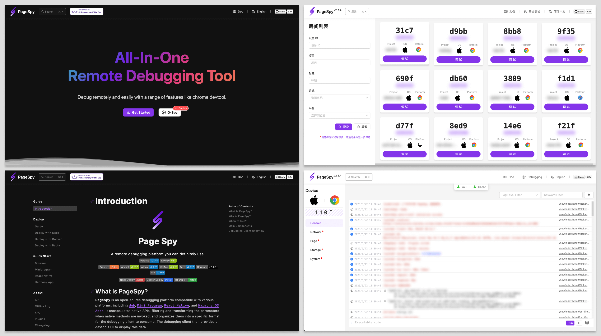

[page-spy]: https://github.com/HuolalaTech/page-spy.git 'page-spy'
[license-img]: https://img.shields.io/github/license/HuolalaTech/page-spy-web?label=License
[license-url]: https://github.com/HuolalaTech/page-spy-web/blob/main/LICENSE
[release-img]: https://img.shields.io/github/package-json/v/HuolalaTech/page-spy-web/release?label=Release
[release-url]: https://github.com/HuolalaTech/page-spy-web/blob/release/package.json
[download-img]: https://img.shields.io/npm/dw/%40huolala-tech/page-spy-api
[download-url]: https://www.npmjs.com/package/@huolala-tech/page-spy-api
[browser-ver-img]: https://img.shields.io/npm/v/@huolala-tech/page-spy-browser?label=Browser%20SDK&color=orange
[browser-ver-url]: https://npmjs.com/package/@huolala-tech/page-spy-browser
[uniapp-ver-img]: https://img.shields.io/npm/v/@huolala-tech/page-spy-uniapp?label=UniApp%20SDK&color=green
[uniapp-ver-url]: https://npmjs.com/package/@huolala-tech/page-spy-uniapp
[wechat-ver-img]: https://img.shields.io/npm/v/@huolala-tech/page-spy-wechat?label=Wechat%20SDK&color=green
[wechat-ver-url]: https://npmjs.com/package/@huolala-tech/page-spy-wechat
[alipay-ver-img]: https://img.shields.io/npm/v/@huolala-tech/page-spy-alipay?label=Alipay%20SDK&color=blue
[alipay-ver-url]: https://npmjs.com/package/@huolala-tech/page-spy-alipay
[taro-ver-img]: https://img.shields.io/npm/v/@huolala-tech/page-spy-taro?label=Taro%20SDK&color=blue
[taro-ver-url]: https://npmjs.com/package/@huolala-tech/page-spy-taro
[harmony-ver-img]: https://harmony.blucas.me/badge/version/@huolala/page-spy-harmony?label=Harmony%20SDK&color=black
[harmony-ver-url]: https://ohpm.openharmony.cn/#/cn/detail/@huolala%2Fpage-spy-harmony
[sdk-build-img]: https://img.shields.io/github/actions/workflow/status/HuolalaTech/page-spy/coveralls.yml?logo=github&label=build
[sdk-build-url]: https://github.com/HuolalaTech/page-spy/actions/workflows/coveralls.yml
[sdk-coveralls-img]: https://img.shields.io/coverallsCoverage/github/HuolalaTech/page-spy?label=coverage&logo=coveralls
[sdk-coveralls-url]: https://coveralls.io/github/HuolalaTech/page-spy?branch=main
[api-ver-img]: https://img.shields.io/github/v/tag/HuolalaTech/page-spy-api?label=API%20version
[api-ver-url]: https://github.com/HuolalaTech/page-spy-api/tags
[api-go-img]: https://img.shields.io/github/go-mod/go-version/HuolalaTech/page-spy-api?label=go
[api-go-url]: https://github.com/HuolalaTech/page-spy-api/blob/master/go.mod

<div align="center">
  

  <h1>Page Spy</h1>

[![Release][release-img]][release-url]
[![license][license-img]][license-url]
[![Build Status][sdk-build-img]][sdk-build-url] <br />
[![Browser SDK version][browser-ver-img]][browser-ver-url]
[![Wechat SDK version][wechat-ver-img]][wechat-ver-url]
[![Alipay SDK version][alipay-ver-img]][alipay-ver-url] <br />
[![UniApp SDK version][uniapp-ver-img]][uniapp-ver-url]
[![Taro SDK version][taro-ver-img]][taro-ver-url]
[![Harmony SDK version][harmony-ver-img]][harmony-ver-url] <br />
[![API Version][api-ver-img]][api-ver-url]
[![Go Version][api-go-img]][api-go-url]

<a href="https://www.producthunt.com/posts/pagespy?utm_source=badge-featured&utm_medium=badge&utm_souce=badge-pagespy" target="_blank"></a> <a href="https://news.ycombinator.com/item?id=38679798" target="_blank"></a>

[English](./README.md) | [中文](./README_ZH.md) | 日本語

</div>

## Intro

PageSpy は、Web / Miniprogram / 鸿蒙（Harmony）OS APP プロジェクトなどのプラットフォームのデバッグに使用されるツールです。

ネイティブ Web API のカプセル化に基づいて、呼び出されたときにネイティブメソッドのパラメータをフィルタリングして変換し、デバッガークライアントが消費するための特定の形式のメッセージに変換します。デバッガーは、メッセージデータを受信した後、対話型の devtools のような ui を表示し、簡単に見ることができる。



## どのような場合に使うべきですか？

<u>ローカルの devtools でコードをデバッグできないときは、いつでも **PageSpy** の出番です！</u>次の例を見てみましょう:

- H5 や webview アプリのローカルでのデバッグ: 従来、H5 で情報を表示できるパネルを提供する製品もありましたが、モバイル端末の小さな画面では操作が不便で、表示もユーザーフレンドリーではありません。情報が切り捨てられるなどの問題もよくあります。
- リモートワークと地域を越えたコラボレーション: 電子メール、電話、ビデオ会議といった従来のコミュニケーションは非効率的で、障害情報は包括的でないため、誤解や誤った判断を招きやすい。
- ユーザーデバイスのホワイトスクリーンの問題: データモニタリングやログ分析などの従来のトラブルシューティングのアプローチは、トラブルシューターがビジネス要件と技術的実装を理解することに依存しています。

これらの問題に共通するのは、開発者がコンソールを使ったときのように簡単にランタイム情報を見ることができないということです。

これに対処するため、PageSpy は技術担当者がデバッグ側で検査できるように、プロジェクトのライブビューを提供します。リモート共同作業シナリオでは、テスト担当者は、テキスト、スクリーンショット、音声メッセージ、または画面録画を通じて、技術担当者に障害情報を頻繁に提供する必要がなくなりました。

## 使用方法は？

データのセキュリティを確保し、利用を容易にするために、私たちは包括的な、すぐに使えるデプロイソリューションを提供しています。開発者は、それぞれの状況に応じて、どのようなデプロイ方法を選択することもできます。

### オプション 1: node によるデプロイ 👍

> ビデオチュートリアル:
>
> <a href="https://www.youtube.com/watch?v=5zVnFPjursQ" target="_blank"></a>

```bash
yarn global add @huolala-tech/page-spy-api@latest

# npm を使用する場合

npm install -g @huolala-tech/page-spy-api@latest
```

ダウンロードが完了したら、コマンドラインで `page-spy-api` を直接実行してサービスを開始することができます。デプロイが成功したら、ブラウザを開いて `<host>:6752` にアクセスすると、上部に `Inject SDK` メニューが表示され、メニューをクリックすると、ビジネスプロジェクトに設定および統合する方法が表示されます。

### オプション 2: docker によるデプロイ

> ビデオチュートリアル:
>
> <a href="https://www.youtube.com/watch?v=AYD84Kht5yA" target="_blank"></a>

```bash
docker run -d --restart=always -v ./log:/app/log -v ./data:/app/data -p 6752:6752 --name="pageSpy" ghcr.io/huolalatech/page-spy-web:latest
```

デプロイが成功したら、ブラウザを開いて `<host>:6752` にアクセスすると、上部に `Inject SDK` メニューが表示され、メニューをクリックすると、ビジネスプロジェクトに設定および統合する方法が表示されます。

## コミュニティ

[公式 Discord サーバー](https://discord.gg/ERPpNZkX)に参加してください！

## ロードマップ

クリックして [Roadmap](https://github.com/orgs/HuolalaTech/projects/1) をご覧ください。

## コントリビュートするには？

クリックして [Contributing](./CONTRIBUTING.md) をご覧ください。

## FAQ

クリックして [FAQ](https://github.com/HuolalaTech/page-spy-web/wiki/faq) をご覧ください。
