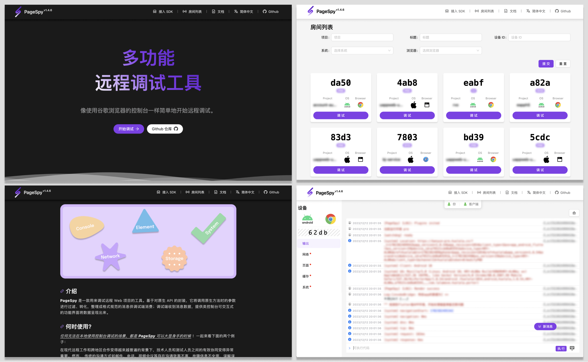
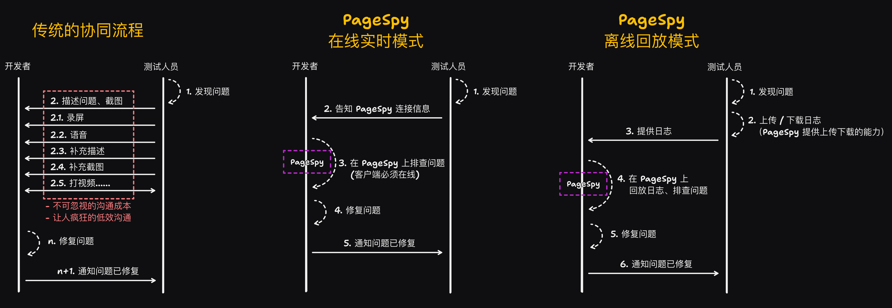

[page-spy]: https://github.com/HuolalaTech/page-spy.git 'page-spy'
[license-img]: https://img.shields.io/github/license/HuolalaTech/page-spy-web?label=License
[license-url]: https://github.com/HuolalaTech/page-spy-web/blob/main/LICENSE
[release-img]: https://img.shields.io/github/package-json/v/HuolalaTech/page-spy-web/release?label=Release
[release-url]: https://github.com/HuolalaTech/page-spy-web/blob/release/package.json
[download-img]: https://img.shields.io/npm/dw/%40huolala-tech/page-spy-api
[download-url]: https://www.npmjs.com/package/@huolala-tech/page-spy-api
[browser-ver-img]: https://img.shields.io/npm/v/@huolala-tech/page-spy-browser?label=Browser&color=orange
[browser-ver-url]: https://npmjs.com/package/@huolala-tech/page-spy-browser
[uniapp-ver-img]: https://img.shields.io/npm/v/@huolala-tech/page-spy-uniapp?label=UniApp&color=green
[uniapp-ver-url]: https://npmjs.com/package/@huolala-tech/page-spy-uniapp
[wechat-ver-img]: https://img.shields.io/npm/v/@huolala-tech/page-spy-wechat?label=Wechat&color=green
[wechat-ver-url]: https://npmjs.com/package/@huolala-tech/page-spy-wechat
[alipay-ver-img]: https://img.shields.io/npm/v/@huolala-tech/page-spy-alipay?label=Alipay&color=blue
[alipay-ver-url]: https://npmjs.com/package/@huolala-tech/page-spy-alipay
[taro-ver-img]: https://img.shields.io/npm/v/@huolala-tech/page-spy-taro?label=Taro&color=blue
[taro-ver-url]: https://npmjs.com/package/@huolala-tech/page-spy-taro
[harmony-ver-img]: https://harmony.blucas.me/badge/version/@huolala/page-spy-harmony?label=Harmony&color=black
[harmony-ver-url]: https://ohpm.openharmony.cn/#/cn/detail/@huolala%2Fpage-spy-harmony
[sdk-build-img]: https://img.shields.io/github/actions/workflow/status/HuolalaTech/page-spy/coveralls.yml?logo=github&label=build
[sdk-build-url]: https://github.com/HuolalaTech/page-spy/actions/workflows/coveralls.yml
[sdk-coveralls-img]: https://img.shields.io/coverallsCoverage/github/HuolalaTech/page-spy?label=coverage&logo=coveralls
[sdk-coveralls-url]: https://coveralls.io/github/HuolalaTech/page-spy?branch=main
[api-ver-img]: https://img.shields.io/github/v/tag/HuolalaTech/page-spy-api?label=API
[api-ver-url]: https://github.com/HuolalaTech/page-spy-api/tags
[api-go-img]: https://img.shields.io/github/go-mod/go-version/HuolalaTech/page-spy-api?label=go
[api-go-url]: https://github.com/HuolalaTech/page-spy-api/blob/master/go.mod
[node-deploy]: https://img.shields.io/badge/Node_Deploy-Install-CB3937
[node-deploy-url]: https://pagespy.org/#/docs/deploy-with-node
[docker-deploy]: https://img.shields.io/badge/Docker_Deploy-Install-1E63ED
[docker-deploy-url]: https://pagespy.org/#/docs/deploy-with-docker
[bt-deploy]: https://img.shields.io/badge/BT_Deploy-Install-20a53a
[bt-deploy-url]: https://pagespy.org/#/docs/deploy-with-baota

<div align="center">
  

  <h1>PageSpy</h1>

[![Release][release-img]][release-url]
[![license][license-img]][license-url]
[![Build Status][sdk-build-img]][sdk-build-url] <br />
[![Browser SDK version][browser-ver-img]][browser-ver-url]
[![Wechat SDK version][wechat-ver-img]][wechat-ver-url]
[![Alipay SDK version][alipay-ver-img]][alipay-ver-url]
[![UniApp SDK version][uniapp-ver-img]][uniapp-ver-url]
[![Taro SDK version][taro-ver-img]][taro-ver-url]
[![Harmony SDK version][harmony-ver-img]][harmony-ver-url]
[![API Version][api-ver-img]][api-ver-url] <br />
[![Deploy with Node][node-deploy]][node-deploy-url]
[![Deploy with Docker][docker-deploy]][docker-deploy-url]
[![Deploy with Baota][bt-deploy]][bt-deploy-url]

<a href="https://trendshift.io/repositories/5407" target="_blank"></a>
<a href="https://www.producthunt.com/posts/pagespy?utm_source=badge-featured&utm_medium=badge&utm_campaign=badge-pagespy" target="_blank"></a>
<a href="https://news.ycombinator.com/item?id=38679798" target="_blank"></a>

[English](./README.md) | 中文 | [日本語](./README_JA.md)

</div>

## 介绍

**PageSpy** 是一款用于调试 Web、React Native、小程序、HarmonyOS 应用等平台项目的工具。

它对原生 API 做了一层封装：在这些方法实际执行时，对入参进行过滤与转换，再按统一格式序列化后发给调试端；调试端以接近本地开发者工具控制台的界面呈现数据。



## 为何使用 PageSpy？

> 一图胜千言。



## 何时使用

_凡是无法在本地用控制台调试的场景，都是 **PageSpy** 能派上用场的时候！_ 下面举几类典型场景：

- **本地调试 H5、WebView 应用**：手机屏幕小，传统调试面板难操作、展示差，日志还常被截断；
- **远程办公与跨地域协作**：邮件、电话、会议来回效率低，错误细节容易丢失，进而产生误解或误判；
- **用户侧白屏等问题排查**：看板、日志链路往往要求排障同学既懂业务又懂技术栈，要在用户设备上把原因收窄，通常很慢。

PageSpy 面向遇到上述问题的团队而打造。

## 如何使用

为了让数据掌握在你自己手中，并降低自建部署的门槛，我们提供多种开箱即用的部署方式，可按运行环境任选其一。

### 方案一：使用 Node.js 部署

> 视频教程：
>
> <a href="https://www.bilibili.com/video/BV1oM4y1p7Le" target="_blank"></a>

```bash
yarn global add @huolala-tech/page-spy-api@latest

# 如果你使用 npm

npm install -g @huolala-tech/page-spy-api@latest
```

安装完成后，在终端执行 `page-spy-api` 启动服务。服务就绪后，在浏览器中打开 `http://localhost:6752`。本地验证通过后，可将同一套部署推到你的服务器。

### 方案二：使用 Docker 部署

> 视频教程：
>
> <a href="https://www.bilibili.com/video/BV1Ph4y1y78R" target="_blank"></a>

```bash
docker run -d --restart=always -v ./log:/app/log -v ./data:/app/data -p 6752:6752 --name="pageSpy" ghcr.io/huolalatech/page-spy-web:latest
```

容器运行后，在浏览器中打开 `http://localhost:6752`。本地验证通过后，可将同一套部署推到你的服务器。

## 参与贡献

请参阅 [Contributing](./CONTRIBUTING_ZH.md)。

## 常见问题

请参阅 [常见问题解答](https://www.pagespy.org/#/docs/faq)。

## 技术支持

有问题可以微信扫码进群交流。

<div style="display: flex; gap: 8px; flex-wrap: nowrap; overflow: auto">
  
</div>
