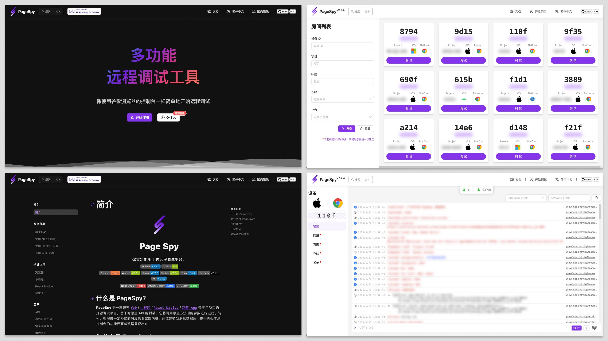

[page-spy]: https://github.com/HuolalaTech/page-spy.git 'page-spy'
[license-img]: https://img.shields.io/github/license/HuolalaTech/page-spy-web?label=License
[license-url]: https://github.com/HuolalaTech/page-spy-web/blob/main/LICENSE
[release-img]: https://img.shields.io/github/package-json/v/HuolalaTech/page-spy-web/release?label=Release
[release-url]: https://github.com/HuolalaTech/page-spy-web/blob/release/package.json
[download-img]: https://img.shields.io/npm/dw/%40huolala-tech/page-spy-api
[download-url]: https://www.npmjs.com/package/@huolala-tech/page-spy-api
[browser-ver-img]: https://img.shields.io/npm/v/@huolala-tech/page-spy-browser?logo=html5&label=version
[browser-ver-url]: https://npmjs.com/package/@huolala-tech/page-spy-browser
[browser-min-img]: https://img.shields.io/bundlephobia/min/@huolala-tech/page-spy-browser?logo=html5&label=size
[browser-min-url]: https://unpkg.com/browse/@huolala-tech/page-spy/dist/index.min.js
[wechat-ver-img]: https://img.shields.io/npm/v/@huolala-tech/page-spy-wechat?logo=wechat&label=version
[wechat-ver-url]: https://npmjs.com/package/@huolala-tech/page-spy-wechat
[wechat-min-img]: https://img.shields.io/bundlephobia/min/@huolala-tech/page-spy-wechat?logo=wechat&label=size
[wechat-min-url]: https://unpkg.com/browse/@huolala-tech/page-spy-wechat/dist/index.min.js
[sdk-build-img]: https://img.shields.io/github/actions/workflow/status/HuolalaTech/page-spy/coveralls.yml?logo=github&label=build
[sdk-build-url]: https://github.com/HuolalaTech/page-spy/actions/workflows/coveralls.yml
[sdk-coveralls-img]: https://img.shields.io/coverallsCoverage/github/HuolalaTech/page-spy?label=coverage&logo=coveralls
[sdk-coveralls-url]: https://coveralls.io/github/HuolalaTech/page-spy?branch=main
[api-ver-img]: https://img.shields.io/github/v/tag/HuolalaTech/page-spy-api?label=API%20version
[api-ver-url]: https://github.com/HuolalaTech/page-spy-api/tags
[api-go-img]: https://img.shields.io/github/go-mod/go-version/HuolalaTech/page-spy-api?label=go
[api-go-url]: https://github.com/HuolalaTech/page-spy-api/blob/master/go.mod

<div align="center">
  

  <h1>Page Spy</h1>

[![Release][release-img]][release-url]
[![license][license-img]][license-url] <br />
[![Build Status][sdk-build-img]][sdk-build-url]
[![Coverage Status][sdk-coveralls-img]][sdk-coveralls-url] <br />
[![Browser version][browser-ver-img]][browser-ver-url]
[![Browser size][browser-min-img]][browser-min-url]
[![Wechat version][wechat-ver-img]][wechat-ver-url]
[![Wechat size][wechat-min-img]][wechat-min-url] <br />
[![API Version][api-ver-img]][api-ver-url]
[![Go Version][api-go-img]][api-go-url]

<a href="https://www.producthunt.com/posts/pagespy?utm_source=badge-featured&utm_medium=badge&utm_souce=badge-pagespy" target="_blank"></a> <a href="https://news.ycombinator.com/item?id=38679798" target="_blank"></a>

[English](./README.md) | 中文

</div>

## 介绍

**PageSpy** 是一款用来调试远程 Web 项目的工具。

基于对原生 API 的封装，它将调用原生方法时的参数进行过滤、转化，整理成格式规范的消息供调试端消费；调试端收到消息数据，提供类控制台可交互式的功能界面将数据呈现出来。



## 何时使用？

<u>任何无法在本地使用控制台调试的场景，都是 **PageSpy** 可以大显身手的时候！</u>一起来看下面的例子：

- 本地调试 H5、Webview 应用：以往有些产品提供了可以在 H5 上查看信息的面板，但移动端屏幕太小操作不便、显示不友好，以及信息被截断等问题；
- 远程办公、跨地区协同：传统沟通方式如邮件、电话、视频会议等，沟通效率不高、故障信息不全面，容易误解误判；
- 用户终端上出现白屏问题：传统定位问题的方式包括数据监控、日志分析等，这些方式依赖排障人员要理解业务需求场景、技术实现；

此类问题的共同点是开发者无法像使用控制台一样查看运行信息。

对此 PageSpy 提供项目运行现场供技术人员在调试端查看，在远程协同场景中，测试人员不用再频繁的通过文字、截图、语音、录屏等方式向技术人员提供故障信息。

## 如何使用？

为了数据安全和方便您的使用，我们提供完整的、开箱即用的多种部署方案，各位开发者可以根据自己的情况选择任意一种部署方式。

### 第一种：使用 Docker 部署

> 视频教程：
>
> <a href="https://www.bilibili.com/video/BV1Ph4y1y78R" target="_blank"></a>

```bash
docker run -d --restart=always -p 6752:6752 --name="pageSpy" ghcr.io/huolalatech/page-spy-web:latest
```

启动完成后浏览器访问 `<host>:6752`，页面顶部会出现 `接入 SDK` 菜单，点击菜单查看如何在业务项目中配置并集成。

### 第二种：使用 Node 部署

> 视频教程：
>
> <a href="https://www.bilibili.com/video/BV1oM4y1p7Le" target="_blank"></a>

```bash
yarn global add @huolala-tech/page-spy-api@latest

# 如果你使用 npm

npm install -g @huolala-tech/page-spy-api@latest
```

安装完成之后你可以在命令行中直接执行 `page-spy-api` 启动服务。部署完成后浏览器访问 `<host>:6752`，页面顶部会出现 `接入 SDK` 菜单，点击菜单查看如何在业务项目中配置并集成。

## 技术支持

有问题可以使用微信扫码进群。

<div style="display: flex; gap: 8px; flex-wrap: nowrap; overflow: auto">
  
  
  
  
</div>

## Roadmap

点击查看 [Roadmap](https://github.com/orgs/HuolalaTech/projects/1)。

## 如何贡献代码？

点击查看 [Contributing](./CONTRIBUTING_ZH.md)。

## FAQ

点击查看 [常见问题解答](https://github.com/HuolalaTech/page-spy-web/wiki/%F0%9F%90%9E-%E5%B8%B8%E8%A7%81%E9%97%AE%E9%A2%98%E8%A7%A3%E7%AD%94)。
