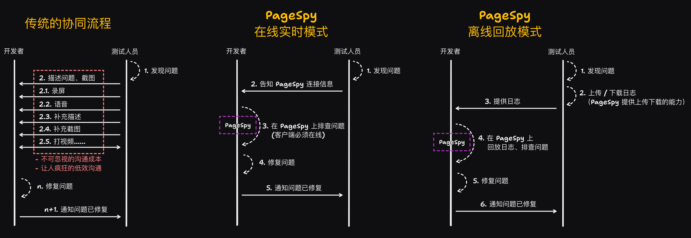

[page-spy]: https://github.com/HuolalaTech/page-spy.git 'page-spy'
[license-img]: https://img.shields.io/github/license/HuolalaTech/page-spy-web?label=License
[license-url]: https://github.com/HuolalaTech/page-spy-web/blob/main/LICENSE
[release-img]: https://img.shields.io/github/package-json/v/HuolalaTech/page-spy-web/release?label=Release
[release-url]: https://github.com/HuolalaTech/page-spy-web/blob/release/package.json
[download-img]: https://img.shields.io/npm/dw/%40huolala-tech/page-spy-api
[download-url]: https://www.npmjs.com/package/@huolala-tech/page-spy-api
[browser-ver-img]: https://img.shields.io/npm/v/@huolala-tech/page-spy-browser?label=Browser&color=orange
[browser-ver-url]: https://npmjs.com/package/@huolala-tech/page-spy-browser
[uniapp-ver-img]: https://img.shields.io/npm/v/@huolala-tech/page-spy-uniapp?label=UniApp&color=green
[uniapp-ver-url]: https://npmjs.com/package/@huolala-tech/page-spy-uniapp
[wechat-ver-img]: https://img.shields.io/npm/v/@huolala-tech/page-spy-wechat?label=Wechat&color=green
[wechat-ver-url]: https://npmjs.com/package/@huolala-tech/page-spy-wechat
[alipay-ver-img]: https://img.shields.io/npm/v/@huolala-tech/page-spy-alipay?label=Alipay&color=blue
[alipay-ver-url]: https://npmjs.com/package/@huolala-tech/page-spy-alipay
[taro-ver-img]: https://img.shields.io/npm/v/@huolala-tech/page-spy-taro?label=Taro&color=blue
[taro-ver-url]: https://npmjs.com/package/@huolala-tech/page-spy-taro
[harmony-ver-img]: https://harmony.blucas.me/badge/version/@huolala/page-spy-harmony?label=Harmony&color=black
[harmony-ver-url]: https://ohpm.openharmony.cn/#/cn/detail/@huolala%2Fpage-spy-harmony
[sdk-build-img]: https://img.shields.io/github/actions/workflow/status/HuolalaTech/page-spy/coveralls.yml?logo=github&label=build
[sdk-build-url]: https://github.com/HuolalaTech/page-spy/actions/workflows/coveralls.yml
[sdk-coveralls-img]: https://img.shields.io/coverallsCoverage/github/HuolalaTech/page-spy?label=coverage&logo=coveralls
[sdk-coveralls-url]: https://coveralls.io/github/HuolalaTech/page-spy?branch=main
[api-ver-img]: https://img.shields.io/github/v/tag/HuolalaTech/page-spy-api?label=API
[api-ver-url]: https://github.com/HuolalaTech/page-spy-api/tags
[api-go-img]: https://img.shields.io/github/go-mod/go-version/HuolalaTech/page-spy-api?label=go
[api-go-url]: https://github.com/HuolalaTech/page-spy-api/blob/master/go.mod
[node-deploy]: https://img.shields.io/badge/Node_Deploy-Install-CB3937
[node-deploy-url]: https://pagespy.org/#/docs/deploy-with-node
[docker-deploy]: https://img.shields.io/badge/Docker_Deploy-Install-1E63ED
[docker-deploy-url]: https://pagespy.org/#/docs/deploy-with-docker
[bt-deploy]: https://img.shields.io/badge/BT_Deploy-Install-20a53a
[bt-deploy-url]: https://pagespy.org/#/docs/deploy-with-baota

<div align="center">
  

  <h1>Page Spy</h1>

[![Release][release-img]][release-url]
[![license][license-img]][license-url]
[![Build Status][sdk-build-img]][sdk-build-url] <br />
[![Browser SDK version][browser-ver-img]][browser-ver-url]
[![Wechat SDK version][wechat-ver-img]][wechat-ver-url]
[![Alipay SDK version][alipay-ver-img]][alipay-ver-url]
[![UniApp SDK version][uniapp-ver-img]][uniapp-ver-url]
[![Taro SDK version][taro-ver-img]][taro-ver-url]
[![Harmony SDK version][harmony-ver-img]][harmony-ver-url]
[![API Version][api-ver-img]][api-ver-url] <br />
[![Deploy with Node][node-deploy]][node-deploy-url]
[![Deploy with Docker][docker-deploy]][docker-deploy-url]
[![Deploy with Baota][bt-deploy]][bt-deploy-url]

<a href="https://trendshift.io/repositories/5407" target="_blank"></a>
<a href="https://www.producthunt.com/posts/pagespy?utm_source=badge-featured&utm_medium=badge&utm_souce=badge-pagespy" target="_blank"></a>
<a href="https://news.ycombinator.com/item?id=38679798" target="_blank"></a>

[English](./README.md) | 中文 | [日本語](./README_JA.md)

</div>

## 介绍

**PageSpy** 是一款用来调试 Web / 小程序 / 鸿蒙 APP 等平台项目的工具。

它基于对原生 API 的封装，将调用原生方法时的参数进行过滤、转化，整理成标准格式传输给调试端；调试端收到数据后，通过类似本地控制台的界面直观呈现出来。


## 为什么是 PageSpy ？

> 一图胜千言。



## 何时使用？

_任何无法在本地使用控制台调试的场景，都是 **PageSpy** 可以大显身手的时候！_ 一起来看下面的几个场景案例：

- **本地调试 H5、Webview 应用**：移动端屏幕太小，传统调试面板操作不便、显示不友好，且容易出现信息截断；
- **远程办公、跨地区协同**：传统沟通方式（邮件、电话、视频会议）效率低，故障信息不完整，容易误解误判；
- **用户终端白屏问题排查**：数据监控、日志分析等传统方式依赖排障人员对业务和技术的深入理解，定位效率低；

PageSpy 的目标，就是为包括以上场景的人员提供帮助。

## 如何使用？

为了数据安全和方便您的使用，我们提供完整的、开箱即用的多种部署方案，各位开发者可以根据自己的情况选择任意一种部署方式。

### 第一种：使用 Node 部署 👍

> 视频教程：
>
> <a href="https://www.bilibili.com/video/BV1oM4y1p7Le" target="_blank"></a>

```bash
yarn global add @huolala-tech/page-spy-api@latest

# 如果你使用 npm

npm install -g @huolala-tech/page-spy-api@latest
```

安装完成之后你可以在命令行中直接执行 `page-spy-api` 启动服务。启动完成后，打开浏览器访问 `http://localhost:6752` 体验，本地测试完成后即可部署到服务器上。

### 第二种：使用 Docker 部署

> 视频教程：
>
> <a href="https://www.bilibili.com/video/BV1Ph4y1y78R" target="_blank"></a>

```bash
docker run -d --restart=always -v ./log:/app/log -v ./data:/app/data -p 6752:6752 --name="pageSpy" ghcr.io/huolalatech/page-spy-web:latest
```

启动完成后，打开浏览器访问 `http://localhost:6752` 体验，本地测试完成后即可部署到服务器上。

## 技术支持

有问题可以使用微信扫码进群。

<div style="display: flex; gap: 8px; flex-wrap: nowrap; overflow: auto">
  
</div>

## Roadmap

点击查看 [Roadmap](https://github.com/orgs/HuolalaTech/projects/1)。

## 如何贡献代码？

点击查看 [Contributing](./CONTRIBUTING_ZH.md)。

## FAQ

点击查看 [常见问题解答](https://www.pagespy.org/#/docs/faq)。
